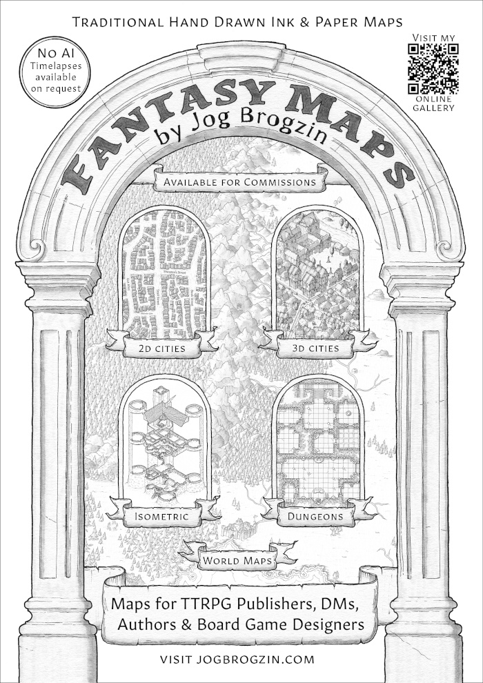

# FunCon One ReadMe

**Welcome to FunCon!** In this Readme you will find some useful information
about the convention, as well as a programme guide and hotel map. All this is
subject to change, and we recommend you keep the online guide handy during the
weekend.

## Venue Map

Click the map to enlarge!

## Important Info

**Volunteering & Rewards:** Thank you to all the lovely people who are helping
out! If you are on Programme, you will receive a Bar Token when you register. If
you sign up as a gopher (at Registration on Friday or in the Leopard’s Den later
in the weekend) you will get a Bar Token when you turn up to help out. As a
small convention with limited budget we can only offer one Bar Token per person,
even if you’re helping out several times, but it comes with a lot of love and
appreciation from us!

**Duty Committee Member (DCM):** Our DCM will be identified by an “In Space No
One Can Hear You Scream” baseball cap, and is your first port of call in case of
any issues. When not out and about solving a problem, you will find them in the
Leopard’s Den (aka Rutland, our Con HQ / Ops / Gopher Hole / etc).

**Health & Safety:** Some of our activities involve risk of injury! You are all
adults, and responsible for your own health and safety. **Please LOOK and THINK
before you ACT!**

**Dead Leopard Party:** You will find exhausted leopards in the hotel bar on
Sunday evening. Join us!

## Space Leopards vs Armadillos

On your badge you will find a star sticker showing your TEAM 🔵**BLUE for Space
Leopards** -or- 🟣**PURPLE for Armadillos**. There is a competition running
throughout the convention between these two teams. This consists of discrete
**Taskmaster-style challenges** running between major programme items, as well
as a list of challenges you can complete in your own time and send in by email.
Some workshops will also have the option to have the thing you have
made/built/done judged at the end. FunCon rewards having FUN, and positive team
spirit, so points may be awarded for other random things throughout the con.
**To take part, pick up a list of tasks at Registration (Friday), or in the
Leopard’s Den (later in the weekend), or [download
here](https://funcon.lol/taskmaster).**

**Code of Conduct:** Be nice to each other! Our [**full
CoC**](https://funcon.lol/code-conduct) can be found here. Any issues, please
contact the Duty Committee Member (DCM) – see above.

**More Info:** Visit [**funcon.lol**](https://funcon.lol)

## Special Thanks

Thanks to Jog Brogzin for the wonderful map at the top of this page. Please see
his ad below, and [**visit his website**](https://jogbrogzin.com).

