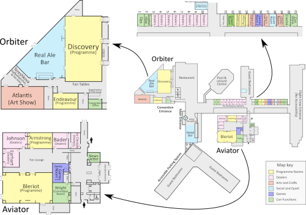

# Welcome to the Reclamation 2022 Online Guide

Reclamation is the 2022 Eastercon, taking place at the Radisson Hotel and Conference Centre, Heathrow, London from 15th to 18th April.

## Registration & Info Desk

Registration & Info Desk will be open 

- Thursday 4pm-6pm
- Friday 9am-7pm
- Saturday 9am-2pm
- Sunday 9am-12noon
- Monday 9am-12noon

When closed, go to Ops in Syndicate Room 1 for assistance, or speak to any member of the Ops team, who’ll be wearing pink hi-vis vests.

## Covid-19 Policy

Please respect one another’s space as much as possible. Hand sanitiser points are located around the hotel. 
Masks should be worn in all indoor public areas of the convention unless you’re eating or drinking. Masks can also be briefly removed for conversations with lip-readers. _If you are exempt, please pick up a badge from the registration desk._

Our full Covid-19 policy is at [https://reclamation2022.co.uk/covid-19/]

## Workshops and Kaffeeklatsches

Sign up for workshops and kaffeeklatsches at the Info Desk.

## Hotel Food

- The hotel’s restaurant, RBG, serves:
  - breakfast from 6am-11am.
  - lunch buffet (£18) from 12.30-3pm
  - dinner buffet (£24.50) from 5.30pm-10:30pm
- Sandwich meal deals can be purchased in Icons, Aviator, and near the Real Ale Bar.
- Hot dogs, burgers, and bacon/egg rolls (£5) can be purchased at various times near the Real Ale Bar.
- A-la-carte room service is available, also delivery from local eateries or app-based food delivery services.

## Real Ale Bar

The convention bar is in Discovery. It will offer a full hotel bar service plus a selection of real ale, cider, and perry. It will be open until 2am depending on demand. Members may take these drinks into all convention areas EXCEPT the Art Show and Dealers’ Rooms.

## Convention Map

Click on map to enlarge.

## Full Convention Readme

Available in booklet form near the Registration Desk, or at [https://reclamation2022.co.uk/assets/uploads/read-me-2022-a4.pdf] 
(Please download this to your phone rather than reloading it as needed, to save our bandwidth!)

## About the Programme Guide

This guide is powered by [ConClár](https://github.com/lostcarpark/conclar), an open source tool for viewing convention schedule.